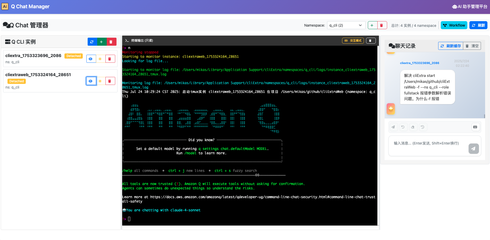

# cliExtra

基于tmux的Amazon Q CLI实例管理系统

一个基于 shell 快速实现的 AWS AI 终端 Q 的多终端交互工具。目标在帮助开发者降低协作多终端的沟通成本。

> **前置要求**: 使用本工具前，请先安装并初始化 Amazon Q CLI。支持免费版本和 Pro 版本。
> 
> 📖 **安装指南**: [Amazon Q CLI 安装文档](https://docs.aws.amazon.com/amazonq/latest/qdeveloper-ug/command-line-installing.html)

## 🌐 图形化管理界面

除了命令行工具，我们还提供了功能强大的 **Web 图形化管理界面**：

### 🔗 [cliExtraWeb - 图形化管理项目](https://github.com/zhoushoujianwork/cliExtraWeb)



### Web 界面特性
- **📊 实例管理面板** - 可视化查看所有实例状态和信息
- **💬 实时聊天界面** - 直接与 AI 实例进行对话交互
- **🔄 Namespace 管理** - 图形化的 namespace 切换和管理
- **📈 统计数据展示** - 实例数量统计和分布可视化
- **🛠️ 工具集成** - Web 端的工具管理和配置
- **📋 Workflow 可视化** - 协作流程和角色关系图形化展示
- **🎯 角色管理** - 可视化的角色预设管理和应用
- **📱 响应式设计** - 支持桌面和移动设备访问

### 使用方式
1. **CLI 管理** - 使用 `cliExtra` 命令进行快速操作
2. **Web 管理** - 通过浏览器访问图形化界面进行可视化管理
3. **混合使用** - CLI 和 Web 界面数据实时同步，可以灵活切换使用

## 功能特点

- **自动生成实例ID**: 支持自动生成与目录相关的实例ID（如：cliExtra_project_timestamp_random），也可自定义实例名
- **统一工作目录管理**: 所有实例信息集中在系统工作目录，项目目录保持干净
- **灵活启动**: 支持当前目录、指定目录或Git仓库克隆启动
- **会话管理**: 基于tmux，支持会话保持和上下文管理
- **实时监控**: 支持实时监控实例输出和日志查看
- **消息发送**: 可以向运行中的实例发送消息
- **实例协作**: 支持实例间协作通信和广播通知
- **单个实例清理**: 支持停止和清理单个实例
- **Namespace管理**: 支持类似k8s namespace的概念，实例归属管理
- **角色预设管理**: 支持前端、后端、测试、代码审查、运维等角色预设
- **Workflow 智能协作**: 支持 namespace 级别的协作流程配置，AI 自动遵循工作流程
- **跨项目协作**: 不同项目的实例可以在同一namespace中协作
- **Web 图形化管理**: 提供完整的 Web 界面进行可视化管理和实时交互
- **全局可用**: 安装后可在系统任何位置使用

## 安装

### 前置条件

在安装 cliExtra 之前，请确保已经安装并初始化了 Amazon Q CLI：

1. **安装 Amazon Q CLI**
   - 访问 [Amazon Q CLI 安装文档](https://docs.aws.amazon.com/amazonq/latest/qdeveloper-ug/command-line-installing.html)
   - 按照文档说明安装适合您系统的版本

2. **初始化 Amazon Q CLI**
   ```bash
   # 初始化 Amazon Q CLI（免费版本或 Pro 版本）
   q login
   ```

### 快速安装

```bash
# 克隆项目
git clone https://github.com/zhoushoujianwork/cliExtra.git
cd cliExtra

# 安装（会创建两个命令：cliExtra 和 qq）
./install.sh
```

安装后可以使用两种命令：
- `cliExtra` - 完整命令名
- `qq` - 简化命令（推荐）

### 手动安装

```bash
# 创建软链接
sudo ln -sf /path/to/cliExtra/cliExtra.sh /usr/local/bin/cliExtra
sudo ln -sf /path/to/cliExtra/cliExtra.sh /usr/local/bin/qq

# 设置执行权限
chmod +x /usr/local/bin/cliExtra
chmod +x /usr/local/bin/qq
```

## 使用方法

### 🌐 Web 图形化管理

访问 [cliExtraWeb 项目](https://github.com/zhoushoujianwork/cliExtraWeb) 获取完整的图形化管理界面，支持：
- 可视化实例管理和监控
- 实时聊天交互界面
- Namespace 和 Workflow 管理
- 角色预设和工具配置

### 📟 命令行管理

### 启动实例

```bash
# 自动生成实例ID（推荐）
qq start                    # 在当前目录启动 (如: cliExtra_myproject_1234567890_1234)
qq start ../                # 在上级目录启动 (如: cliExtra_parentdir_1234567890_5678)
qq start /path/to/project   # 在指定目录启动 (如: cliExtra_project_1234567890_9012)
qq start https://github.com/user/repo.git  # 克隆并启动 (如: cliExtra_repo_1234567890_3456)

# 指定实例名字
qq start --name myproject   # 在当前目录启动，实例名为myproject
qq start ../ --name test    # 在上级目录启动，实例名为test

# 应用角色预设
qq start --role frontend    # 启动并应用前端工程师角色
qq start --name backend --role backend  # 启动并应用后端工程师角色
```

### 实例管理

```bash
# 列出所有实例（简洁格式，每行一个实例ID）
qq list

# 列出所有实例（JSON格式，包含详细信息和namespace）
qq list -o json

# 显示指定实例的详细信息（包含namespace）
qq list myinstance

# 显示指定实例的详细信息（JSON格式，包含namespace）
qq list myinstance -o json

# 查看实例状态
qq status myproject

# 发送消息到实例
qq send myproject "你好，Q!"

# 接管实例终端
qq attach myproject

# 停止实例（保留数据，可恢复）
qq stop myproject

# 恢复已停止的实例，载入历史上下文
qq resume myproject
qq start --context myproject  # 等效命令

# 创建新实例并加载指定实例的历史上下文
qq start --name new-instance --context old-instance

# 清理单个实例（停止并删除文件）
qq clean myproject

# 清理所有实例
qq clean all

# 清理指定namespace中的所有实例
qq clean all --namespace frontend

# 预览将要清理的实例（不实际执行）
qq clean all --dry-run
qq clean all --namespace backend --dry-run
```

### 配置管理

```bash
# 查看当前配置和系统状态
qq config show

# 获取特定配置项
qq config get home          # 显示工作目录
qq config get os            # 显示操作系统类型

# 自定义工作目录（如果需要）
qq config set home /custom/path

# 重置为默认配置
qq config reset
```

### 角色预设管理

```bash
# 列出所有可用角色
qq role list

# 显示角色预设内容
qq role show frontend
qq role show           # 显示当前目录的角色（只显示角色名）
qq role show ./        # 显示指定目录的角色（只显示角色名）

# 应用角色预设到项目或实例
qq role apply frontend             # 当前目录应用前端工程师角色
qq role apply backend myproject    # 指定实例应用后端工程师角色

# 强制应用（不需要确认，适合自动化脚本）
qq role apply devops -f            # 强制应用运维工程师角色
qq role apply frontend myproject -f
qq role apply backend -f myproject # 参数顺序灵活

# 移除项目/实例中的角色预设
qq role remove
qq role remove myproject
```

### Namespace管理

```bash
# 创建namespace
qq ns create frontend
qq ns create backend
qq ns create devops

# 查看namespace
qq ns show                    # 显示所有namespace
qq ns show frontend           # 显示frontend namespace详情
qq ns show -o json            # JSON格式输出

# 删除namespace（完全清理）
qq ns delete frontend         # 删除 namespace 及所有相关目录和文件
qq ns delete backend --force  # 强制删除（停止其中的实例并清理所有数据）

# 启动实例到指定namespace
qq start --namespace frontend
qq start --name api --ns backend

# 修改实例的namespace
qq set-ns myinstance backend  # 将实例移动到backend namespace
```

### 工具管理

```bash
# 查看所有可用工具
qq tools list

# 以JSON格式查看所有可用工具
qq tools list -o json

# 显示工具详细信息
qq tools show git
qq tools show dingtalk

# 添加工具到当前项目（自动覆盖已存在的工具）
qq tools add git              # 添加git工具
qq tools add dingtalk         # 添加钉钉工具

# 移除项目中的工具
qq tools remove git           # 移除git工具
qq tools remove dingtalk      # 移除钉钉工具

# 查看当前项目已安装的工具
qq tools installed

# 指定项目路径操作工具
qq tools add git --project /path/to/project
```

**注意**: `qq tools add` 命令会自动覆盖已存在的同名工具，确保使用最新版本的工具配置。

### 对话记录和回放

```bash
# 查看可用的对话记录
qq replay list

# 回放指定实例的对话记录
qq replay instance backend-api
qq replay instance frontend-dev --format json

# 回放指定namespace的消息历史
qq replay namespace development
qq replay namespace backend --format timeline

# 限制显示记录数量
qq replay instance backend-api --limit 10

# 显示指定时间后的记录
qq replay namespace development --since "2025-01-20"
```

### 实例协作

```bash
# 发送消息到指定实例
qq send backend-api "API开发完成，请进行前端集成"

# 广播消息到所有实例
qq broadcast "系统维护通知：今晚22:00-24:00进行系统升级"

# 广播到指定namespace
qq broadcast "前端组件库更新" --namespace frontend

# 排除特定实例的广播
qq broadcast "测试环境重启" --exclude self

# 预览广播目标（不实际发送）
qq broadcast "部署通知" --dry-run
```

**注意**: 每个项目建议只保留一个角色预设，多个角色可能导致意图识别混乱。应用新角色时会自动移除现有角色。

### AI协作感知

每个角色实例都具备协作感知能力：

- **自动识别协作场景**: 完成工作后主动询问是否需要通知其他实例
- **智能推荐协作对象**: 基于工作内容推荐合适的协作实例
- **标准化协作消息**: 提供协作消息模板，确保信息传递准确
- **跨职能任务识别**: 识别需要多角色协作的任务并建议启动专门实例

协作示例：
```bash
# 后端工程师完成API开发后，AI会主动询问：
# "API开发已完成，是否需要通知前端工程师进行集成？"
# 建议命令：qq send frontend-dev "API接口已完成，请进行前端集成测试"

# 运维工程师完成部署后，AI会建议：
# "部署环境已准备完成，建议广播通知相关开发团队"
# 建议命令：qq broadcast "生产环境部署完成，可以开始发布" --namespace backend
```

### 角色预设结构

当应用角色预设时，会在项目目录下创建 `.amazonq` 目录：

```
project/
├── .amazonq/
│   └── rules/              # Amazon Q规则目录
│       ├── [role]-engineer.md    # 具体角色预设文件
│       └── role-boundaries.md    # 通用角色边界限制规则
└── ... (项目文件)
```

**重要**: 
- 每个项目只保留一个角色预设，确保意图识别的准确性
- 应用新角色时会自动替换现有角色
- 通用边界规则确保每个角色专注于自己的职责范围
- 遇到跨职能任务时，系统会主动建议启动专门的实例

## 项目结构

cliExtra 采用工作目录统一管理的方式，所有实例信息都存储在系统工作目录中，项目目录只保留配置文件：

### 工作目录结构

```
# macOS 系统
~/Library/Application Support/cliExtra/
├── config                      # 全局配置
├── namespaces/                 # 所有namespace统一管理
│   ├── default/                # default namespace
│   │   ├── instances/          # 实例目录
│   │   │   └── instance_123/
│   │   │       ├── tmux.log    # tmux会话日志
│   │   │       ├── info        # 实例详细信息
│   │   │       ├── project_path # 项目路径引用
│   │   │       └── namespace   # namespace信息（向后兼容）
│   │   ├── logs/               # 实例日志目录
│   │   │   └── instance_123.log
│   │   ├── conversations/      # 对话记录目录
│   │   │   └── instance_123.json
│   │   └── namespace_cache.json # namespace缓存
│   ├── frontend/               # frontend namespace
│   │   ├── instances/
│   │   ├── logs/
│   │   ├── conversations/
│   │   └── namespace_cache.json
│   └── backend/                # backend namespace
│       ├── instances/
│       ├── logs/
│       ├── conversations/
│       └── namespace_cache.json
└── projects/                   # Git克隆的项目（可选）
    └── cloned-repo/

# Linux 系统
~/.cliExtra/                    # 普通用户使用用户目录
# 或
/opt/cliExtra/                  # root 用户使用系统级目录
├── config
├── namespaces/
│   ├── default/
│   ├── frontend/
│   └── backend/
└── projects/
```

### 项目目录结构

每个被管理的项目目录只包含配置文件，不存储实例运行信息：

```
/path/to/your/project/
├── .amazonq/
│   └── rules/                  # Amazon Q规则目录（自动同步）
│       ├── frontend-engineer.md    # 前端工程师角色预设
│       ├── backend-engineer.md     # 后端工程师角色预设
│       ├── devops-engineer.md      # 运维工程师角色预设
│       ├── cliextra-collaboration.md # 协作增强规则
│       ├── role-boundaries.md      # 角色边界规则
│       ├── tools_git.md            # Git工具能力（自动安装）
│       └── tools_dingtalk.md       # 钉钉工具能力（手动添加）
└── ... (项目文件)
```

### 目录设计优势

1. **统一管理**: 所有实例信息集中在工作目录，便于管理和备份
2. **项目隔离**: 项目目录保持干净，只包含必要的配置文件
3. **跨项目协作**: 不同项目的实例可以在同一namespace中协作
4. **系统级服务**: 支持系统级的实例管理和监控
5. **向后兼容**: 保持对旧版本目录结构的兼容性
6. **完整清理**: namespace 删除时完全清理所有相关目录和文件
7. **安全保护**: 防止误删默认 namespace，支持强制删除模式

## tmux操作

- **接管会话**: `tmux attach-session -t q_instance_<id>`
- **分离会话**: 在会话中按 `Ctrl+B, D`
- **查看所有**: `tmux list-sessions`

## 卸载

```bash
# 使用卸载脚本
./install.sh uninstall

# 或手动删除软链接
sudo rm -f /usr/local/bin/cliExtra
sudo rm -f /usr/local/bin/qq
```

## 故障排除

### 命令不可用
如果安装后 `qq` 或 `cliExtra` 命令不可用：
1. 检查PATH环境变量是否包含安装目录
2. 运行 `source ~/.zshrc` 或 `source ~/.bashrc`
3. 重新打开终端

### 权限问题
如果遇到权限问题：
```bash
sudo ./install.sh
```

### 软链接问题
如果软链接有问题：
```bash
sudo rm -f /usr/local/bin/cliExtra /usr/local/bin/qq
sudo ln -sf /path/to/cliExtra/cliExtra.sh /usr/local/bin/cliExtra
sudo ln -sf /path/to/cliExtra/cliExtra.sh /usr/local/bin/qq
```

## 依赖

- **Amazon Q CLI**: AI 助手核心（必需）
- **tmux**: 会话管理
- **Git**: 仓库克隆（可选）
- **Bash**: 脚本执行

## 更新日志

### 2025-07-23
- **修复**: 修复了 `qq ns show -o json` 命令的显示问题
  - 现在能正确显示所有存在的 namespace（包括 default）
  - 修复了 JSON 输出格式，确保 instances 数组格式正确
  - 改进了 namespace 检测逻辑，支持从目录结构和配置文件中获取
  - 增强了实例计数的准确性

## 许可证
MIT License
